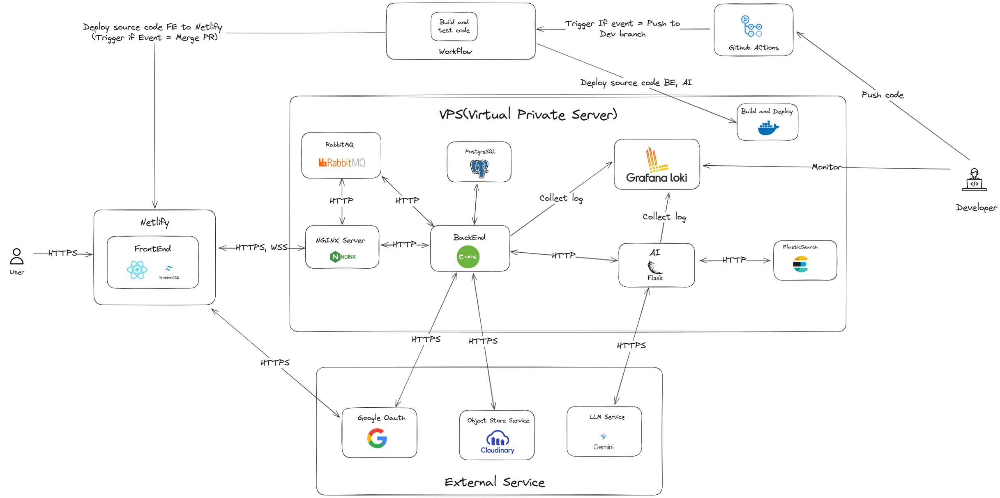

# Chat Ebook Server

## Overview

The `chat-ebook-server` is a Java-based backend application designed to power a chat-based ebook interaction platform. It provides APIs and services for handling user authentication, ebook content management, chat functionalities, and more. The application is designed to be deployed using Docker containers for easy setup and scalability.

- **Description**: Backend server for https://chat-ebook.netlify.app/
- **Language**: Java

## Table of Contents

- [Overview](#overview)
- [Features](#features)
- [Architecture](#architecture)
- [Getting Started](#getting-started)
  - [Prerequisites](#prerequisites)
  - [Installation](#installation)
- [Usage](#usage)
- [Configuration](#configuration)
- [Contributing](#contributing)
- [License](#license)

## Features

- **User Authentication**: Secure user registration and login.
- **Ebook Management**: Upload, store, and manage ebook content.
- **Chat Functionality**: Real-time chat interface for users to interact with ebooks.
- **AI Integration**: Integration with AI services for enhanced ebook interaction.
- **Feedback Collection**: Collect user feedback to improve the platform.
- **Subscription Management**: Handle user subscriptions and payments.
- **Observation and Monitoring**: Monitor application performance and usage.

## Architecture

The application follows a modular architecture with several key components:

- **AI**: AI-related services for intelligent ebook interaction.
- **Chat**: Real-time chat functionality.
- **Common**: Common utilities and shared code.
- **Dashboard**: Dashboard services for monitoring and analytics.
- **Feedback**: Feedback collection and management.
- **File**: File storage and management services.
- **Mail**: Email services for notifications and communication.
- **Mindmap**: Mindmap generation and management.
- **Security**: Security and authentication services.
- **Subscription**: Subscription management services.
- **Web**: Web application components.

The architecture is designed to be containerized using Docker, with services orchestrated using Docker Compose.

## Getting Started

### Prerequisites

- [Docker](https://www.docker.com/get-started)
- [Docker Compose](https://docs.docker.com/compose/install/)

### Installation

1.  Clone the repository:

    ```bash
    git clone https://github.com/phdhuy/chat-ebook-server.git
    cd chat-ebook-server
    ```

2.  Run Docker Compose to start the application:

    ```bash
    docker-compose up --build
    ```

    This command builds the Docker images and starts all the necessary services, including:

    -   `postgres`: PostgreSQL database
    -   `rabbitmq`: RabbitMQ message broker
    -   `redis`: Redis cache
    -   `backend`: Spring Boot application
    -   `nginx`: Nginx reverse proxy
    -   `prometheus`: Prometheus monitoring
    -   `tempo`: Tempo tracing
    -   `loki`: Loki logging
    -   `grafana`: Grafana dashboard

## Usage

Once the application is up and running, you can access the following services:

-   **Backend**: [http://localhost:8081](http://localhost:8081)
-   **Nginx**: [http://localhost](http://localhost)
-   **Grafana**: [http://localhost:3000](http://localhost:3000) (admin/password)
-   **Prometheus**: [http://localhost:9090](http://localhost:9090)
-   **Tempo**: [http://localhost:3200](http://localhost:3200)
-   **RabbitMQ Management**: [http://localhost:15672](http://localhost:15672) (guest/guest)

## Configuration

The application is configured using environment variables. Here are the key environment variables that can be configured:

-   `SPRING_DATASOURCE_URL`: JDBC URL for the PostgreSQL database.
-   `SPRING_DATASOURCE_USERNAME`: Username for the PostgreSQL database.
-   `SPRING_DATASOURCE_PASSWORD`: Password for the PostgreSQL database.
-   `SPRING_RABBITMQ_HOST`: Hostname for the RabbitMQ server.
-   `SPRING_RABBITMQ_PORT`: Port for the RabbitMQ server.
-   `SPRING_RABBITMQ_USERNAME`: Username for the RabbitMQ server.
-   `SPRING_RABBITMQ_PASSWORD`: Password for the RabbitMQ server.

These environment variables can be set in the `docker-compose.yml` file or passed directly to the Docker containers.

## Contributing

Contributions are welcome! Please follow these steps:

1.  Fork the repository.
2.  Create a new branch for your feature or bug fix.
3.  Make your changes and commit them with clear, descriptive messages.
4.  Submit a pull request.

## Overview Architecture

  

## License

This project is open source and available under the [MIT License](LICENSE).
